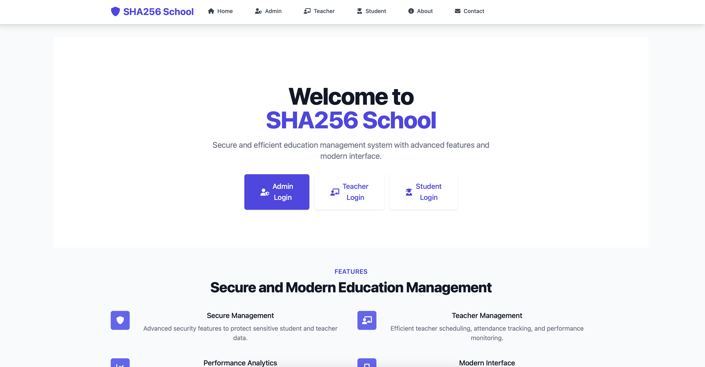
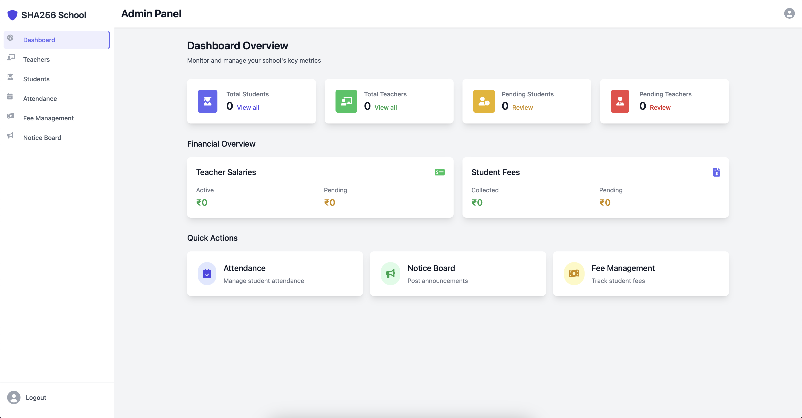
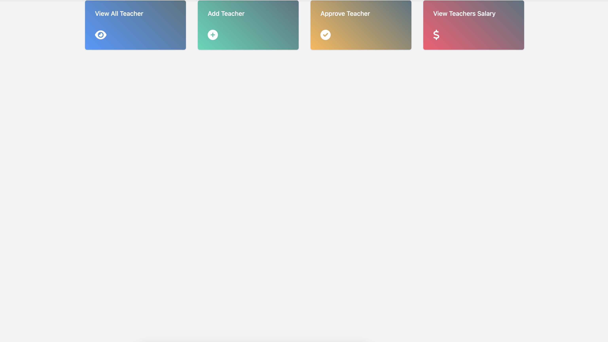
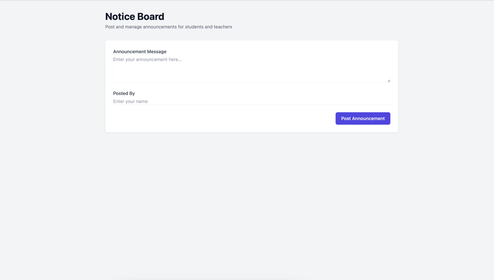

# SHA256 School Management System

A modern and responsive school management system built with Django and Tailwind CSS. This system helps educational institutions manage their administrative tasks, student records, teacher information, attendance tracking, and fee management efficiently.

## Screenshots

### Landing Page

Modern landing page with role-based access options and key features highlight.

### Admin Dashboard

Comprehensive admin dashboard with statistics, financial overview, and quick actions.

### Student Management

Efficient student management interface with registration and monitoring capabilities.

### Teacher Portal

Dedicated teacher portal for managing classes, attendance, and student performance.

### Fee Management

Streamlined fee management system with payment tracking and reporting.

### Notice Board

Interactive notice board for important announcements and updates.

## Features

- **Modern UI/UX**: Built with Tailwind CSS for a clean and responsive design
- **Role-based Access**: Separate portals for administrators, teachers, and students
- **Dashboard Analytics**: Visual representation of key metrics and statistics
- **User Management**: 
  - Student registration and management
  - Teacher registration and management
  - Admin controls and oversight
- **Academic Features**:
  - Attendance tracking
  - Fee management
  - Notice board functionality
  - Student performance monitoring
- **Financial Management**:
  - Student fee tracking
  - Teacher salary management
  - Financial overview and reporting

## Tech Stack

- **Backend**: Django 3.0.5
- **Frontend**: 
  - Tailwind CSS
  - Alpine.js
  - Font Awesome
- **Database**: SQLite (default)
- **Authentication**: Django's built-in authentication system

## Installation

1. Clone the repository:
   ```bash
   git clone https://github.com/yourusername/school-management-system.git
   cd school-management-system
   ```

2. Create a virtual environment and activate it:
   ```bash
   python -m venv venv
   source venv/bin/activate  # On Windows, use: venv\Scripts\activate
   ```

3. Install dependencies:
   ```bash
   pip install -r requirements.txt
   ```

4. Apply migrations:
   ```bash
   python manage.py migrate
   ```

5. Create a superuser:
   ```bash
   python manage.py createsuperuser
   ```

6. Run the development server:
   ```bash
   python manage.py runserver
   ```

7. Visit `http://127.0.0.1:8000/` in your browser

## Usage

1. **Admin Portal**:
   - Access via `/adminlogin`
   - Manage students and teachers
   - Monitor attendance
   - Handle fee management
   - Post notices

2. **Teacher Portal**:
   - Access via `/teacherlogin`
   - Take attendance
   - View student performance
   - Access notice board

3. **Student Portal**:
   - Access via `/studentlogin`
   - View attendance
   - Check fee status
   - Read notices

## Contributing

1. Fork the repository
2. Create your feature branch (`git checkout -b feature/AmazingFeature`)
3. Commit your changes (`git commit -m 'Add some AmazingFeature'`)
4. Push to the branch (`git push origin feature/AmazingFeature`)
5. Open a Pull Request

## License

This project is licensed under the MIT License - see the [LICENSE](LICENSE) file for details.

## Last Updated

November 17, 2023

## Acknowledgments

- Built with Django web framework
- UI components powered by Tailwind CSS
- Icons by Font Awesome
- Interactive components with Alpine.js 
